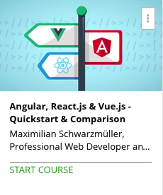

```
Roberto Nogueira  
BSd EE, MSd CE
Solution Integrator Experienced - Certified by Ericsson
```
# Udemy project



**About **

Angular, React or Vue? JavaScript Frameworks can be confusing. Time for an Introduction and Comparison!

[Homepage](https://www.udemy.com/angular-reactjs-vuejs-quickstart-comparison/)

## Topics
```
Section: 1
0 / 18
Getting Started
[x] 1. Introduction 1:18
[x] 2. The Goal of this Course 2:31
[x] 3. Understanding the Role of JavaScript 3:48
[x] 4. The World of JavaScript 1:36
[x] 5. Using Vanilla JavaScript & Understanding Its Limitations (1/3) 5:17
[x] 6. Using Vanilla JavaScript & Understanding Its Limitations (2/3) 2:12
[x] 7. Using Vanilla JavaScript & Understanding Its Limitations (3/3) 4:40
[x] 8. Analyzing the Vanilla JavaScript Solution 2:28
[x] 9. Improving the App with jQuery 7:01
[x] 10. More JavaScript Libraries: Adding Lodash 2:56
[ ] 11. The Role of JavaScript Libraries 1:20
[ ] 12. Libraries vs Frameworks 2:50
[ ] 13. Using Vue.js (A JavaScript Framework) 15:02
[ ] 14. Understand other Parts of the JavaScript World 3:55
[ ] 15. JavaScript Versions and Languages - ES6 and TypeScript 3:56
[ ] 16. Course Structure 2:59
[ ] 17. Where to Find the Course Source Code 0:00
[ ] 18. Module Resources 0:00

Section: 2
0 / 9
Understanding JavaScript Frameworks in General
[ ] 19. Module Introduction 0:34
[ ] 20. JS Frameworks in Fullstack Applications 2:37
[ ] 21. JS Frameworks in Single-Page-Applications 2:45
[ ] 22. An Example for a Framework in a Fullstack Application 4:29
[ ] 23. An Example for a Framework running a Single-Page-Application 1:50
[ ] 24. Fullstack Approach - Pros and Cons 4:07
[ ] 25. Single-Page-Application - Pros and Cons 4:28
[ ] 26. Prerequisites for the Different JS Frameworks 3:37
[ ] 27. Module Resources 0:00

Section: 3
0 / 34
Vue.js - An Introduction
[ ] 28. Module Introduction 1:33
[ ] 29. Creating a Basic Vue.js Application 3:23
[ ] 30. In a Nutshell: How Vue.js Works 2:06
[ ] 31. Handling Events and Updating the DOM 3:57
[ ] 32. Rendering Content Conditionally 3:15
[ ] 33. Outputting Lists 3:27
[ ] 34. Binding HTML Attributes & Properties to Data 3:38
[ ] 35. Styling Elements Dynamically 3:24
[ ] 36. Setting CSS Classes Dynamically 1:45
[ ] 37. Using Shorthands for v-bind and v-on 0:00
[ ] 38. Using Multiple Vue Instances 1:39
[ ] 39. Limitations of Multiple Vue Instances 1:55
[ ] 40. Creating and Using Components 4:30
[ ] 41. Passing Data into Components 1:42
[ ] 42. Emitting Custom Events in Components 3:15
[ ] 43. Template Restrictions 1:37
[ ] 44. Two-Way-Binding to Input Fields 1:55
[ ] 45. Time to Practice - Vue.js - Problem 2:20
[ ] 46. Time to Practice - Vue.js - Solution 15:33
[ ] 47. Creating Vue.js Projects with the Vue CLI 3:16
[ ] 48. Why do we need Node.js and NPM? 1:32
[ ] 49. Using the Vue CLI to Create Projects 3:11
[ ] 50. Understanding the Project Folder 4:50
[ ] 51. Understanding .vue Files 3:06
[ ] 52. How the Application Gets Rendered 2:26
[ ] 53. Creating Global Components with .vue Files 3:42
[ ] 54. Creating Local Components 2:25
[ ] 55. Scoping Styles to Components 1:18
[ ] 56. Creating a Single Page Application (SPA) 1:08
[ ] 57. Adding Routing to the Application 5:57
[ ] 58. Linking with router-link 1:31
[ ] 59. Routing and the Server-Side 2:15
[ ] 60. Wrap Up 1:10
[ ] 61. Module Resources & Further Resources 0:00

Section: 4
0 / 7
Understanding Workflows & Webpack
[ ] 62. Module Introduction 0:58
[ ] 63. The Big Picture 2:47
[ ] 64. The Role of Node.js and NPM 3:38
[ ] 65. Why do we need a Development Server? 2:30
[ ] 66. How Webpack Works: Entry & Output 4:00
[ ] 67. How Webpack Works: Modules, Rules & Plugins 4:24
[ ] 68. Wrap Up 0:58

Section: 5
0 / 30
React.js - An Introduction
[ ] 69. Module Introduction 1:14
[ ] 70. Using React.js to Create a Basic App 4:22
[ ] 71. Understanding How React.js Works and JSX 3:45
[ ] 72. Outputting Dynamic Content 1:20
[ ] 73. Handling Events and Updating the DOM 4:22
[ ] 74. Creating a First Component 2:48
[ ] 75. Passing Data into Components (Props) 1:51
[ ] 76. Creating Components using ES6 Classes 2:36
[ ] 77. More about ES6 0:00
[ ] 78. Using State in React.js Components 5:02
[ ] 79. What Happens Behind the Scenes 2:18
[ ] 80. Rendering Conditional Content 3:18
[ ] 81. Outputting Lists 5:18
[ ] 82. Setting Styles Dynamically 3:11
[ ] 83. Setting CSS Classes Dynamically 2:05
[ ] 84. User Input & Two-Way-Binding 3:23
[ ] 85. Using Multiple Components 2:45
[ ] 86. Dumb Components 1:13
[ ] 87. Passing Data from Child to Parent 4:11
[ ] 88. Time to Practice - React.js - Problem 2:35
[ ] 89. Time to Practice - React.js - Solution 23:59
[ ] 90. Switching to a Local Setup & SPA 1:23
[ ] 91. Using the "create-react-app" Package 2:34
[ ] 92. Understanding the Created Project 2:48
[ ] 93. Using the Local Setup 2:38
[ ] 94. Adding React Router and Routes for the App 6:36
[ ] 95. Adding Links 1:46
[ ] 96. The React Router and a Server 1:20
[ ] 97. Wrap Up 1:23
[ ] 98. Module Resources & Further Resources 0:00

Section: 6
0 / 32
Angular (2 & 4) - An Introduction
[ ] 99. Module Introduction 1:07
[ ] 100. What It's Good at and What It's Not Good At 1:45
[ ] 101. Understanding Angular Versioning 0:48
[ ] 102. TypeScript 3:00
[ ] 103. TypeScript - A Brief Introduction 0:00
[ ] 104. Creating an Angular Project with the CLI 3:47
[ ] 105. Understanding the Project Structure 3:31
[ ] 106. Understanding the Role of Components and the App Component 3:01
[ ] 107. How the App Starts 5:16
[ ] 108. Understanding the App Module 2:04
[ ] 109. Outputting Data with String Interpolation 1:31
[ ] 110. Handling Events 2:41
[ ] 111. Rendering Content Conditionally 3:26
[ ] 112. Outputting Lists 4:02
[ ] 113. Binding Data to (HTML and other) Properties 2:57
[ ] 114. Adding Dynamic Styles to Elements 4:23
[ ] 115. Adding CSS Classes Dynamically 2:45
[ ] 116. When to use the * Syntax 1:00
[ ] 117. Using Multiple Components 6:09
[ ] 118. Passing Data Into Components 2:04
[ ] 119. Emitting Custom Events From Components 5:39
[ ] 120. Using Two-Way-Binding 3:04
[ ] 121. Time to Practice - Angular - Problem 1:53
[ ] 122. Time to Practice - Angular - Solution 15:10
[ ] 123. Using the CLI to Generate Components 1:58
[ ] 124. Nesting Multiple Components 1:56
[ ] 125. Scoping Styles to Components 1:17
[ ] 126. Adding Routing & Routes 4:52
[ ] 127. Adding Links 1:56
[ ] 128. The Angular Router and the Server 1:08
[ ] 129. Wrap Up 1:31
[ ] 130. Module Resources & Further Resources 0:00

Section: 7
0 / 11
Comparing the Frameworks
[ ] 131. Module Introduction 1:12
[ ] 132. Possible Comparison Dimensions 3:43
[ ] 133. Dimension 1: The Learning Curve 7:54
[ ] 134. Dimension 2: Downscaling & Fullstack Applications 6:53
[ ] 135. Dimension 3: Upscaling & SPAs 10:40
[ ] 136. Dimension 4: Performance 9:00
[ ] 137. Dimension 5: Ease of Deployment (The Way from Dev to Production) 8:13
[ ] 138. Dimension 6: Popularity & Job Market 12:36
[ ] 139. The Verdict 2:31
[ ] 140. ...What About jQuery? 1:41
[ ] 141. Module Resources 0:00

Section: 8
0 / 1
Course Roundup
[ ] 142. Course Roundup 1:43
```
